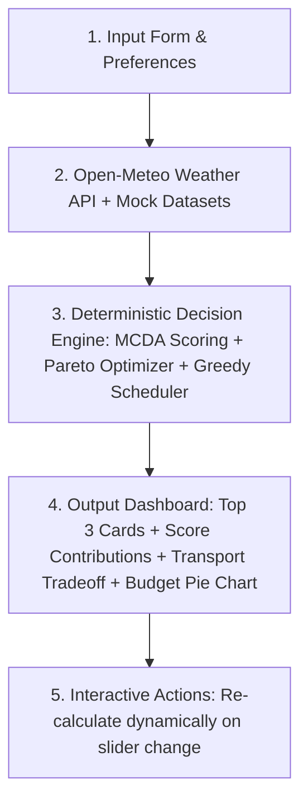

# TravelGO — Smart Travel & Mobility Decision Intelligence System


> **TravelGO** là lớp ứng dụng trí tuệ nhân tạo hỗ trợ ra quyết định du lịch và tối ưu phương tiện đi lại tích hợp cho người Việt. Hệ thống giúp người dùng giải quyết bài toán "Đi đâu? Đi bằng gì? Lịch trình thế nào? Phân bổ ngân sách ra sao?" theo hướng minh bạch, có thể giải thích và kiểm chứng được.

---

## 🎯 5-Step Decision Intelligence Workflow



---

## 🏗 System Architecture

```text
travel-go/
├── frontend/                     # React + TypeScript + TailwindCSS + Recharts
│   ├── src/
│   │   ├── components/           # Form, Charts, Cards, Itinerary, Explanation
│   │   ├── types/                # TypeScript interfaces matching BE DTOs
│   │   ├── api/                  # API Integration Client
│   │   └── App.tsx
├── backend/                      # Spring Boot 3 + Java 17/21
│   ├── src/main/java/com/travelgo/
│   │   ├── controller/           # TripController (/api/v1/plan-trip)
│   │   ├── service/              # TripPlanningService, LLMExplainerService
│   │   ├── decision/             # Core Math Decision Engines (mcda, pareto, itinerary)
│   │   ├── dto/                  # Request & Response DTOs
│   │   ├── data/                 # DataLoader via Jackson ObjectMapper
│   │   └── external/             # Open-Meteo Weather Client
│   └── src/main/resources/data/   # 5 Mock Datasets JSON
├── docs/                         # Architecture & Runbook
└── README.md
```

---

## 🚀 Quick Start (Local Run)

### Backend (Spring Boot 3)
```bash
cd backend
./mvnw spring-boot:run
# Server runs on http://localhost:8080
```

### Frontend (React + Vite)
```bash
cd frontend
npm install
npm run dev
# App runs on http://localhost:5173
```

---

## 🧪 3 Demo Preset Test Cases (For Judges)

1. **Preset 1 (Default)**: Đà Lạt 3N2Đ — Ngân sách 4.000.000 VNĐ (Nhóm 2 người).
2. **Preset 2**: Phú Quốc 4N3Đ — Ngân sách 8.000.000 VNĐ (Gia đình).
3. **Preset 3**: Vũng Tàu 2N1Đ — Ngân sách 1.500.000 VNĐ (Phượt xe máy).

---

## 🛡 License
Distributed under the MIT License. See `LICENSE` for more information.
